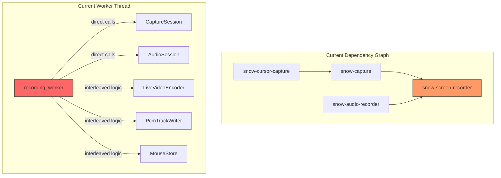
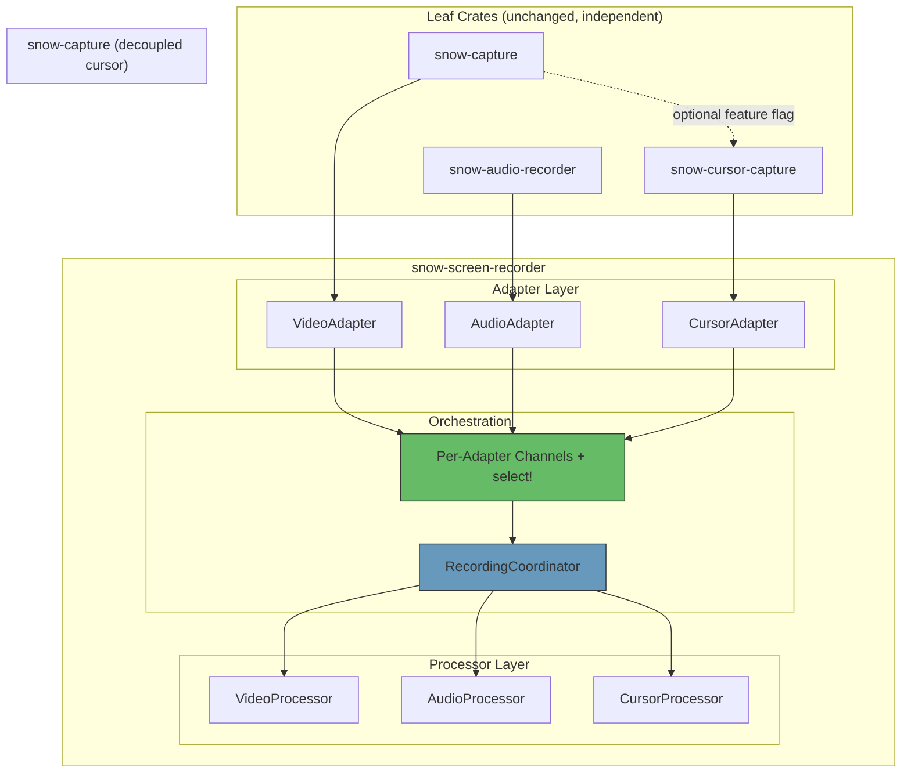
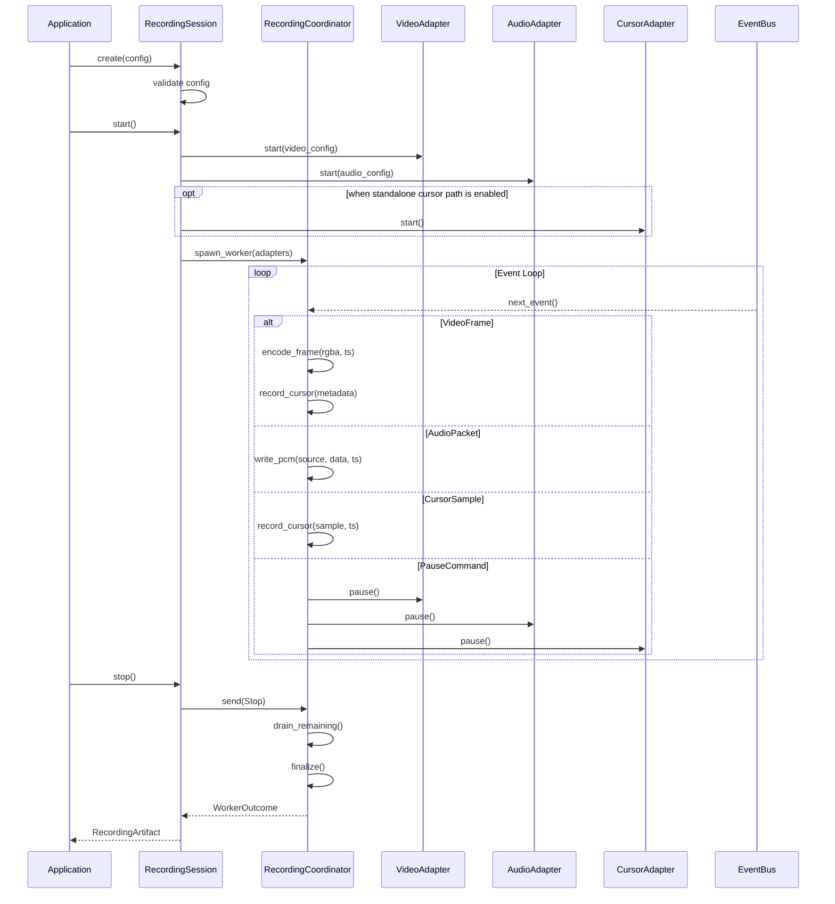
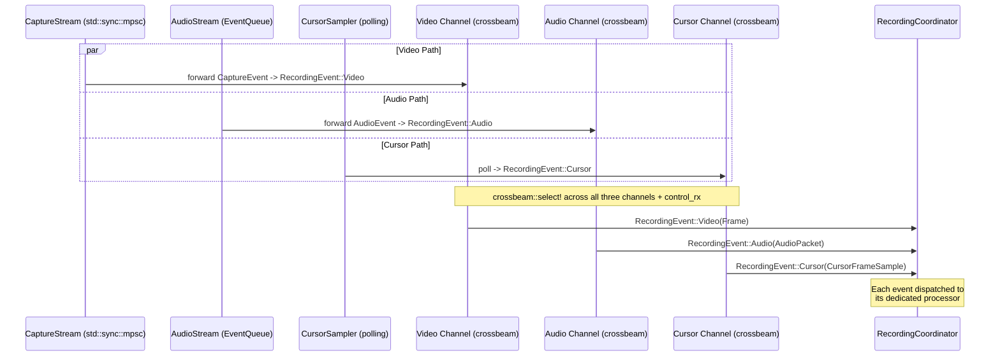

# Design Document: Screen Recorder Architecture

## Overview

The snow workspace contains four crates designed to work together for screen recording: `snow-cursor-capture` (cursor sampling), `snow-audio-recorder` (dual-source audio capture), `snow-capture` (video frame capture), and `snow-screen-recorder` (orchestration, encoding, editing). While each leaf crate was designed for independent use, the current composition in `snow-screen-recorder` suffers from tight coupling, type duplication, and a monolithic worker thread that interleaves all subsystem logic.

This design proposes a trait-based composition architecture that keeps the leaf crates fully independent while introducing shared abstractions at the orchestration layer. The key insight is that all three subsystems already follow the same pattern (session builder -> streaming handle -> channel-based events) but lack a shared vocabulary for the orchestrator to treat them uniformly. Rather than forcing shared traits into the leaf crates (which would couple them), we define adapter traits in `snow-screen-recorder` and decompose the monolithic worker into focused, single-responsibility processors connected by a unified event bus.

## Architecture

### Current Architecture (Problems)



**Problems identified:**
1. `snow-capture` hard-depends on `snow-cursor-capture`; cursor capture is baked into the video pipeline
2. `RecordingConfig` directly references `snow_capture::MonitorId`, `snow_capture::WindowId`, `snow_audio_recorder::DeviceSelector`; this leaks sub-crate types into the public API
3. `WorkerContext` handles video encoding, audio writing, cursor recording, preview encoding, and pause timeline in one struct (~300 lines)
4. Mouse types are duplicated: `CursorFrameSample`/`CursorShape` in `snow-cursor-capture` vs `CursorFrameRecord`/`CursorShapeRecord` in `snow-screen-recorder/mouse.rs`
5. `map_cursor_composition_mode()` manually converts between two identical enums
6. No way to test the orchestration logic without real capture/audio backends
7. The event loop polls video and audio with different strategies (blocking `recv_timeout` on `std::sync::mpsc` for video, non-blocking `try_recv` on a custom `EventQueue` for audio); this is asymmetric and fragile

### Proposed Architecture




## Sequence Diagrams

### Recording Lifecycle



### Unified Event Flow



## Channel Architecture

### Channel Type Mismatch

The three subsystems use different channel implementations:

| Subsystem | Internal Channel | API |
|---|---|---|
| `snow-capture` | `std::sync::mpsc::sync_channel` | `StreamHandle::{recv, try_recv, recv_timeout}` |
| `snow-audio-recorder` | Custom `EventQueue` (Mutex + Condvar) | `AudioStreamHandle::recv()`, `try_recv()`, `recv_timeout()` |
| `snow-cursor-capture` | None (synchronous polling) | `CursorSampler::sample()` |

`crossbeam_channel` is only a dependency of `snow-screen-recorder`, not the leaf crates. The `crossbeam::select!` macro requires `crossbeam_channel::Receiver`, so we cannot directly select across the heterogeneous channel types.

### Design Decision: Per-Adapter Forwarding Threads

Each adapter spawns a thin forwarding thread that bridges its leaf crate's native channel into a dedicated `crossbeam_channel::Sender<RecordingEvent>`. The coordinator then uses `crossbeam::select!` across the per-adapter receivers plus the control channel.

**Why per-adapter channels instead of a single shared channel:**
- A single shared channel risks cross-stream starvation: a burst of video frames (which are large, about 8 MB at 1080p) can block audio forwarding, causing audio gaps. The current architecture avoids this by polling each stream independently.
- Per-adapter channels allow the coordinator to prioritize: for example, always drain the audio channel before processing the next video frame, preventing audio underruns.
- Per-adapter bounded channels let each subsystem apply independent backpressure. Video can tolerate frame drops (via `FrameDropped` events) while audio should never drop packets.
- The `select!` macro handles fairness across multiple receivers natively.

**Why not migrate snow-capture to crossbeam:**
- `snow-capture` is designed as an independent crate. Adding a `crossbeam-channel` dependency would couple it to a specific channel implementation.
- The `std::sync::mpsc::sync_channel` is adequate for snow-capture's needs (bounded, blocking send).
- The forwarding thread cost is minimal: one `recv()` -> `send()` per frame at 60 FPS.
- If a future version of snow-capture adopts crossbeam, the forwarding thread can be removed without changing the adapter trait.

### Adapter Ownership Constraint and Resolution

`snow-capture::StreamHandle::receiver()` returns a borrowed receiver (`&mpsc::Receiver<_>`), so the adapter cannot safely clone or move that receiver into a `'static` forwarding thread while retaining pause/resume/stop control on the handle.

To keep this architecture implementable without changing leaf crate APIs, the forwarding thread owns the entire stream handle and receives control commands through a dedicated command channel.

```rust
enum AdapterCommand {
    Pause,
    Resume,
    Stop,
}
```

The adapter object stores `cmd_tx` plus a thread join handle. `pause()/resume()/stop()` enqueue commands; the forwarding thread applies those commands to the owned leaf handle and forwards data events.

```rust
// Per-adapter channel layout
struct RecordingAdapters {
    video_rx: crossbeam_channel::Receiver<RecordingEvent>,
    audio_rx: crossbeam_channel::Receiver<RecordingEvent>,
    cursor_rx: crossbeam_channel::Receiver<RecordingEvent>,
    adapters: Vec<Box<dyn StreamAdapter>>,
}
```


## Components and Interfaces

### Component 1: Unified Event Type

**Purpose**: Single enum that the coordinator receives, replacing the current asymmetric polling of separate channels.

```rust
/// Unified event type for the recording coordinator.
/// All subsystem events are normalized into this enum so the
/// event loop can use crossbeam::select! across per-adapter channels.
pub(crate) enum RecordingEvent {
    Video(VideoCaptureEvent),
    Audio(AudioCaptureEvent),
    Cursor(CursorCaptureEvent),
}

pub(crate) enum VideoCaptureEvent {
    Frame {
        rgba: Vec<u8>,
        width: u32,
        height: u32,
        timestamp: StreamTimestamp,
        is_duplicate: bool,
    },
    ResolutionChanged {
        old_width: u32,
        old_height: u32,
        new_width: u32,
        new_height: u32,
    },
    FrameDropped { sequence: u64 },
    /// The capture backend paused. Carries the backend's own timestamp
    /// for accurate pause-point tracking.
    Paused { at: Instant },
    /// The capture backend resumed. Carries the backend's own timestamp
    /// and the measured gap duration.
    Resumed { at: Instant, gap: Duration },
    StreamEnded,
    Error(Box<dyn std::error::Error + Send + Sync>),
}

pub(crate) enum AudioCaptureEvent {
    Packet {
        source: AudioSourceKind,
        data: Vec<u8>,
        frames: u32,
        format: AudioFormat,
        timestamp: StreamTimestamp,
    },
    PacketDropped {
        source: AudioSourceKind,
        dropped_frames: u64,
    },
    SourceRestarted {
        source: AudioSourceKind,
        old_device_id: Option<String>,
        new_device_id: String,
        downtime: Duration,
    },
    Paused { at: Instant },
    Resumed { at: Instant, gap: Duration },
    BufferPressure {
        fill_ratio: f64,
        buffer_depth: usize,
    },
    StreamEnded,
    Error(Box<dyn std::error::Error + Send + Sync>),
}

pub(crate) enum CursorCaptureEvent {
    Sample(CursorFrameSample),
    StreamEnded,
    Error(Box<dyn std::error::Error + Send + Sync>),
}

pub(crate) enum ControlCommand {
    Pause,
    Resume,
    Stop,
}

/// Normalized timestamp that works across subsystems.
/// Both snow-capture (`present_time_qpc`) and snow-audio-recorder
/// (`qpc_position_100ns`) provide a 100ns-resolution QPC-derived value
/// on Windows, so we carry that plus `Instant` for fallback.
#[derive(Clone, Debug)]
pub(crate) struct StreamTimestamp {
    pub instant: Instant,
    pub qpc_100ns: Option<i64>,
}
```

**Key design decisions:**

- `VideoCaptureEvent::Frame` does **not** carry `cursor: Option<CursorFrameSample>`. See "Cursor Data Path Policy" below for rationale.
- `ControlCommand` is **not** part of `RecordingEvent`; control commands travel on a separate control channel to avoid mixing control-plane and data-plane backpressure.
- `CursorCaptureEvent` includes a `StreamEnded` variant so the coordinator can track cursor stream termination alongside video and audio.
- Error types use `Box<dyn std::error::Error + Send + Sync>` (not just `Send`) for composability with `anyhow::Error` and other error ecosystems that require `Sync`.
- `VideoCaptureEvent::Paused` and `Resumed` preserve the backend's timestamps from `CaptureEvent::Paused { at }` and `CaptureEvent::Resumed { at, gap }`, rather than substituting `Instant::now()` at the coordinator level. This avoids a timestamp accuracy regression: the backend's `at` reflects the actual pause point, while `Instant::now()` at the coordinator would include channel latency.
- Audio lifecycle/pressure events (`Paused`, `Resumed`, `SourceRestarted`, `BufferPressure`) are forwarded explicitly. The coordinator may choose to ignore some for timeline accounting, but they remain visible for diagnostics and tests.

**Responsibilities**:
- Provide a single type for the event loop to match on
- Normalize timestamps across video and audio subsystems
- Carry enough information for each processor without requiring access to sub-crate internals

### Cursor Data Path Policy

The current `snow-capture` embeds cursor data in `FrameMetadata::cursor` when `capture_cursor` is enabled. The proposed architecture also introduces a separate `CursorStreamAdapter`. This creates two potential cursor data paths that must not produce duplicate records.

**Policy: Feature-flag-driven single path.**

| `snow-capture` cursor feature | `CursorStreamAdapter` active | Cursor data source |
|---|---|---|
| Enabled (default) | No | Frame-embedded `FrameMetadata::cursor` |
| Disabled | Yes | Standalone `CursorStreamAdapter` polling |

- When `snow-capture` is built with the `cursor` feature (the default), `CaptureSession::capture_cursor(true)` is used and cursor data arrives embedded in each video frame. The `VideoStreamAdapter` extracts `frame.metadata.cursor` and forwards it directly to the `CursorProcessor` through the cursor channel. No `CursorStreamAdapter` is created.
- When `snow-capture` is built **without** the `cursor` feature, `FrameMetadata` has no `cursor` field. A standalone `CursorStreamAdapter` is created that polls `CursorSampler` at the target FPS and sends `CursorCaptureEvent::Sample` events on its own channel.
- The `RecordingSession::start()` method inspects a compile-time `cfg` flag to decide which path to use. There is no runtime ambiguity.

Feature wiring in `snow-screen-recorder` must forward the dependency feature explicitly:

```toml
[features]
default = ["cursor"]
cursor = ["snow-capture/cursor"]
```

```rust
impl RecordingSession {
    pub fn start(&mut self) -> Result<()> {
        // ...
        #[cfg(feature = "cursor")]
        {
            // Cursor data comes embedded in video frames.
            // VideoStreamAdapter forwards cursor samples to cursor channel.
            // No CursorStreamAdapter needed.
        }
        #[cfg(not(feature = "cursor"))]
        {
            // Standalone cursor polling adapter.
            let cursor_adapter = CursorStreamAdapter::start(
                cursor_tx,
                self.config.fps,
            )?;
        }
        // ...
    }
}
```

This eliminates ambiguity and guarantees cursor data path exclusivity.

### Component 2: Stream Adapters

**Purpose**: Bridge between leaf crate streaming handles and the per-adapter crossbeam channels. Each adapter owns a leaf crate's stream handle on a forwarding thread that translates native events into `RecordingEvent` variants.

```rust
/// Trait for subsystem stream adapters.
///
/// Each adapter owns a forwarding thread that reads from the leaf
/// crate's native channel and writes to a crossbeam channel. The
/// trait provides lifecycle control and thread joining.
pub(crate) trait StreamAdapter: Send {
    /// Signal the underlying stream to pause.
    fn pause(&self) -> Result<()>;
    /// Signal the underlying stream to resume.
    fn resume(&self) -> Result<()>;
    /// Signal the underlying stream to stop. Does not block.
    fn stop(&self) -> Result<()>;
    /// Returns false once the forwarding thread has fully exited.
    fn is_running(&self) -> bool;
    /// Join the forwarding thread, blocking until it exits.
    /// After join returns, no more events will be sent to the
    /// adapter's crossbeam channel. Remaining events live in
    /// the channel and must be drained by the coordinator.
    fn join(&mut self) -> Result<()>;
}

/// Adapts snow_capture::StreamHandle -> RecordingEvent::Video.
///
/// The forwarding thread owns the stream handle and receives
/// control commands (`Pause`, `Resume`, `Stop`) via `cmd_rx`.
pub(crate) struct VideoStreamAdapter {
    cmd_tx: crossbeam_channel::Sender<AdapterCommand>,
    forward_thread: Option<std::thread::JoinHandle<Result<()>>>,
}

/// Adapts snow_audio_recorder::AudioStreamHandle -> RecordingEvent::Audio.
///
/// Same command-channel ownership model as video.
pub(crate) struct AudioStreamAdapter {
    cmd_tx: crossbeam_channel::Sender<AdapterCommand>,
    forward_thread: Option<std::thread::JoinHandle<Result<()>>>,
}

/// Adapts snow_cursor_capture::CursorSampler -> RecordingEvent::Cursor.
///
/// Only created when snow-capture is built without the `cursor` feature.
/// Polls CursorSampler at the target FPS on a dedicated thread.
pub(crate) struct CursorStreamAdapter {
    cmd_tx: crossbeam_channel::Sender<AdapterCommand>,
    poll_thread: Option<std::thread::JoinHandle<Result<()>>>,
}
```

**Adapter lifecycle and drain contract:**

The previous design had `stop_and_drain(self: Box<Self>) -> Vec<RecordingEvent>`, which doesn't match the actual architecture. Events are forwarded into per-adapter crossbeam channels by the forwarding threads. After `stop()`, remaining events live in the crossbeam channels, not inside the adapter.

To avoid deadlock with bounded channels, shutdown must keep draining while forwarders are still alive:

1. `adapter.stop()` signals the underlying stream to stop (non-blocking)
2. While any adapter is still running, keep draining event channels (audio-first policy)
3. `adapter.join()` after forwarders have exited
4. Final drain pass on all channels

```rust
// Shutdown sequence in recording_worker
fn shutdown(adapters: &mut RecordingAdapters, coordinator: &mut RecordingCoordinator) -> Result<()> {
    // 1. Signal all streams to stop
    for adapter in &adapters.adapters {
        adapter.stop()?;
    }

    // 2. Keep draining while forwarders are alive (prevents send-side deadlock).
    while adapters.adapters.iter().any(|a| a.is_running()) {
        // Prioritize audio to minimize underruns.
        for _ in 0..8 {
            match adapters.audio_rx.try_recv() {
                Ok(event) => coordinator.handle_event(event)?,
                Err(crossbeam_channel::TryRecvError::Empty) => break,
                Err(crossbeam_channel::TryRecvError::Disconnected) => break,
            }
        }
        for event in adapters.video_rx.try_iter().take(2) {
            coordinator.handle_event(event)?;
        }
        for event in adapters.cursor_rx.try_iter().take(16) {
            coordinator.handle_event(event)?;
        }
        std::thread::sleep(Duration::from_millis(2));
    }

    // 3. Join all forwarding threads
    for adapter in &mut adapters.adapters {
        adapter.join()?;
    }

    // 4. Drain remaining events from per-adapter channels
    for event in adapters.video_rx.try_iter() {
        coordinator.handle_event(event)?;
    }
    for event in adapters.audio_rx.try_iter() {
        coordinator.handle_event(event)?;
    }
    for event in adapters.cursor_rx.try_iter() {
        coordinator.handle_event(event)?;
    }

    Ok(())
}
```

**Responsibilities**:
- Own forwarding-thread lifecycle and command channel
- Spawn a forwarding thread that bridges native channels to crossbeam
- Provide pause/resume/stop/join lifecycle control with error propagation
- Enable testing by allowing mock adapters that write directly to crossbeam channels

### Component 3: Event Processors

**Purpose**: Single-responsibility handlers for each data stream. Extracted from the current monolithic `WorkerContext`.

```rust
/// Processes video frames: encoding to H.264 via ffmpeg.
///
/// Owns both the primary encoder (for the recording temp file) and
/// the optional preview encoder. The current WorkerContext has a
/// `preview_encoder` field that is preserved here; it is used for
/// generating a low-latency preview stream during recording.
pub(crate) struct VideoProcessor {
    encoder: Option<LiveVideoEncoder>,
    preview_encoder: Option<LiveVideoEncoder>,
    width: u32,
    height: u32,
    target_fps: u32,
    video_format: RecordingVideoFormat,
    video_config: VideoEncodeConfig,
    last_encoded_rgba: Option<Vec<u8>>,
    video_temp_path: PathBuf,
}

/// Processes audio packets: PCM alignment and writing.
pub(crate) struct AudioProcessor {
    system_writer: Option<PcmTrackWriter>,
    mic_writer: Option<PcmTrackWriter>,
    recorded_system: bool,
    recorded_mic: bool,
}

/// Processes cursor data: shape dedup and frame recording.
pub(crate) struct CursorProcessor {
    mouse_store: MouseStore,
    shapes_emitted: HashSet<u64>,
    last_frame: Option<CursorFrameRecord>,
    capture_origin_x: i32,
    capture_origin_y: i32,
}
```

**Responsibilities**:
- `VideoProcessor`: Frame validation, primary encoder lifecycle, preview encoder lifecycle, duplicate frame handling
- `AudioProcessor`: PCM writing, silence insertion, sample format conversion
- `CursorProcessor`: Shape deduplication, coordinate translation, synthetic frame generation on drops

### Component 4: RecordingCoordinator

**Purpose**: Replaces the current `recording_worker` function and `WorkerContext`. Owns the event loop and dispatches to processors.

```rust
/// Coordinates the recording pipeline.
/// Owns the timeline, receives unified events, dispatches to processors.
pub(crate) struct RecordingCoordinator {
    timeline: PauseTimeline,
    video: VideoProcessor,
    audio: AudioProcessor,
    cursor: CursorProcessor,
    last_observed_ts_ms: Option<u64>,
    frame_interval_ms: u32,
    capture_ended: bool,
    audio_ended: bool,
    cursor_ended: bool,
}

impl RecordingCoordinator {
    pub fn handle_event(&mut self, event: RecordingEvent) -> Result<EventAction> {
        match event {
            RecordingEvent::Video(ve) => self.handle_video(ve),
            RecordingEvent::Audio(ae) => self.handle_audio(ae),
            RecordingEvent::Cursor(ce) => self.handle_cursor(ce),
        }
    }

    pub fn handle_control(&mut self, cmd: ControlCommand) -> Result<EventAction> {
        // Control-plane handling stays separate from data-plane routing.
        todo!()
    }

    /// Returns true when all data streams have ended.
    fn all_streams_ended(&self) -> bool {
        self.capture_ended && self.audio_ended && self.cursor_ended
    }

    pub fn finalize(self, at: Instant) -> Result<WorkerOutcome> {
        // Flush primary and preview encoders, write mouse store, close PCM writers
        todo!()
    }
}

pub(crate) enum EventAction {
    Continue,
    Stop,
}
```

**Responsibilities**:
- Own the pause timeline (single source of truth for active elapsed time)
- Dispatch events to the correct processor
- Track stream-ended states for all three streams (video, audio, cursor) for graceful shutdown
- Produce `WorkerOutcome` on finalization


## Data Models

### Eliminating Mouse Type Duplication

The current codebase has two parallel type hierarchies for cursor data:

| snow-cursor-capture | snow-screen-recorder/mouse.rs | Relationship |
|---|---|---|
| `CursorCompositionMode` | `CursorShapeCompositionMode` | Identical semantics |
| `CursorShape` | `CursorShapeRecord` | Same fields + serde |
| `CursorFrameSample` | `CursorFrameRecord` | Same fields + timestamp + serde |

**Proposed solution**: Keep `mouse.rs` types as the serialization layer (they need `serde`), but derive them directly from cursor-capture types without manual field-by-field conversion:

```rust
// In snow-screen-recorder/src/mouse.rs

use serde::{Deserialize, Serialize};

// Re-export the canonical composition mode from snow-cursor-capture
// and provide a serde-compatible mirror for serialization only.
#[derive(Clone, Copy, Debug, Serialize, Deserialize, PartialEq, Eq)]
pub enum CursorShapeCompositionMode {
    AlphaBlend,
    MaskedColor,
}

impl From<snow_cursor_capture::CursorCompositionMode> for CursorShapeCompositionMode {
    fn from(mode: snow_cursor_capture::CursorCompositionMode) -> Self {
        match mode {
            snow_cursor_capture::CursorCompositionMode::AlphaBlend => Self::AlphaBlend,
            snow_cursor_capture::CursorCompositionMode::MaskedColor => Self::MaskedColor,
        }
    }
}

impl CursorShapeRecord {
    /// Convert from the canonical cursor-capture type.
    pub fn from_cursor_shape(shape: &snow_cursor_capture::CursorShape) -> Self {
        Self {
            shape_id: shape.shape_id,
            hotspot_x: shape.hotspot_x,
            hotspot_y: shape.hotspot_y,
            width: shape.width,
            height: shape.height,
            mode: shape.composition_mode.into(),
            shape_rgba: shape.shape_rgba.clone(),
        }
    }
}

impl CursorFrameRecord {
    /// Convert from the canonical cursor-capture type with timestamp
    /// and coordinate translation.
    pub fn from_sample(
        sample: &snow_cursor_capture::CursorFrameSample,
        timestamp_ms: u64,
        origin_x: i32,
        origin_y: i32,
    ) -> Self {
        Self {
            timestamp_ms,
            x: sample.position_x - origin_x,
            y: sample.position_y - origin_y,
            visible: sample.visible,
            shape_id: sample.shape_id,
        }
    }
}
```

This eliminates the manual `map_cursor_composition_mode()` function and the field-by-field construction scattered through `WorkerContext::record_cursor_frame()`.

### Decoupling RecordingConfig from Sub-Crate Types

```rust
// Current: leaks sub-crate types
pub enum RecordingTarget {
    PrimaryMonitor,
    Monitor(snow_capture::MonitorId),      // -> direct dependency
    Window(snow_capture::WindowId),        // -> direct dependency
    Region(snow_capture::CaptureRegion),   // -> direct dependency
}

// Proposed: own types with conversion at the boundary
pub enum RecordingTarget {
    PrimaryMonitor,
    Monitor(MonitorSelector),
    Window(WindowSelector),
    Region(RecordingRegion),
}
```

#### MonitorSelector Resolution

`MonitorSelector` wraps a `stable_id` string that uniquely identifies a monitor across sessions. The `stable_id` is composed of the DXGI adapter LUID and output ID, formatted as `"{adapter_luid:016x}-{output_id:016x}"`; this matches the existing `MonitorId::stable_id()` format in `snow-capture`.

```rust
/// Opaque monitor selector that doesn't expose snow-capture internals.
/// The `stable_id` is a hex string of the form `"{adapter_luid:016x}-{output_id:016x}"`,
/// matching the format produced by `snow_capture::MonitorId::stable_id()`.
#[derive(Clone, Debug)]
pub struct MonitorSelector {
    stable_id: String,
}

impl MonitorSelector {
    /// Create a selector from a stable ID string.
    pub fn from_stable_id(id: impl Into<String>) -> Self {
        Self { stable_id: id.into() }
    }

    pub fn stable_id(&self) -> &str {
        &self.stable_id
    }
}

/// Opaque window selector.
#[derive(Clone, Copy, Debug)]
pub struct WindowSelector {
    raw_handle: isize,
}

/// Recording region in virtual desktop coordinates.
#[derive(Clone, Copy, Debug)]
pub struct RecordingRegion {
    pub x: i32,
    pub y: i32,
    pub width: u32,
    pub height: u32,
}
```

Resolution from `MonitorSelector` to `snow_capture::MonitorId` happens at the adapter boundary during `RecordingSession::start()`:

```rust
impl VideoStreamAdapter {
    fn resolve_capture_target(
        target: &RecordingTarget,
        capture_session: &CaptureSession,
    ) -> Result<CaptureTarget> {
        match target {
            RecordingTarget::PrimaryMonitor => Ok(CaptureTarget::PrimaryMonitor),
            RecordingTarget::Monitor(sel) => {
                // Enumerate monitors and match by stable_id
                let monitors = capture_session.enumerate_monitors()
                    .map_err(ScreenRecorderError::Capture)?;
                let monitor = monitors.into_iter()
                    .find(|m| m.stable_id() == sel.stable_id())
                    .ok_or_else(|| ScreenRecorderError::InvalidConfig(
                        format!("monitor with stable_id '{}' not found; \
                                 the monitor may have been disconnected", sel.stable_id())
                    ))?;
                Ok(CaptureTarget::Monitor(monitor))
            }
            RecordingTarget::Window(sel) => {
                Ok(CaptureTarget::Window(WindowId::from_raw(sel.raw_handle)))
            }
            RecordingTarget::Region(r) => {
                Ok(CaptureTarget::Region(CaptureRegion {
                    x: r.x, y: r.y,
                    width: r.width, height: r.height,
                }))
            }
        }
    }
}
```

If the monitor is not found (e.g., disconnected between config creation and recording start), the error message includes the `stable_id` for diagnostics.

### Decoupling Cursor from snow-capture (Feature Flag)

Currently `snow-capture` hard-depends on `snow-cursor-capture` and embeds cursor data in `FrameMetadata`. This couples video capture to cursor capture at the crate level.

```toml
# snow-capture/Cargo.toml (proposed)
[features]
default = ["cursor"]
cursor = ["dep:snow-cursor-capture"]

[dependencies]
snow-cursor-capture = { path = "../snow-cursor-capture", optional = true }
```

```rust
// snow-capture/src/frame.rs (conditional cursor support)
#[cfg(feature = "cursor")]
pub use snow_cursor_capture::{CursorCompositionMode, CursorFrameSample, CursorShape};

#[cfg(feature = "cursor")]
pub type CursorData = CursorFrameSample;

#[derive(Clone, Debug, Default)]
pub struct FrameMetadata {
    // ... existing fields ...

    #[cfg(feature = "cursor")]
    pub cursor: Option<CursorData>,
}
```

**Semver impact**: This is a **breaking change** for `snow-capture`. The crate currently re-exports `CursorCompositionMode`, `CursorData`, `CursorFrameSample`, and `CursorShape` unconditionally from `lib.rs`. Making these conditional behind a feature flag removes them from the default public API for any downstream consumer that opts out of the `cursor` feature. Even though the `cursor` feature defaults to enabled, this is a semver-breaking change because:
- Downstream crates that use `default-features = false` will lose these re-exports
- The `FrameMetadata` struct layout changes based on feature flags, which affects any code that constructs or pattern-matches on it

**Recommended approach**: Bump `snow-capture` to `0.2.0` when this change lands. Provide a deprecation notice in `0.1.x` release notes. Downstream consumers that need cursor types should either keep the `cursor` feature enabled (the default) or depend on `snow-cursor-capture` directly.


## Key Functions with Formal Specifications

### Function 1: `RecordingCoordinator::handle_event`

```rust
impl RecordingCoordinator {
    pub fn handle_event(&mut self, event: RecordingEvent) -> Result<EventAction> {
        match event {
            RecordingEvent::Video(ve) => self.handle_video(ve),
            RecordingEvent::Audio(ae) => self.handle_audio(ae),
            RecordingEvent::Cursor(ce) => self.handle_cursor(ce),
        }
    }

    pub fn handle_control(&mut self, cmd: ControlCommand) -> Result<EventAction> {
        // control-plane handling is separate from data-plane events
        todo!()
    }
}
```

**Preconditions:**
- `self` is in a valid state (not yet finalized)
- `event` carries a well-formed payload (non-zero dimensions for frames, valid sample format for audio)

**Postconditions:**
- Returns `EventAction::Continue` for non-terminal events
- Returns `EventAction::Stop` when all streams have ended (`capture_ended && audio_ended && cursor_ended`)
- Video frames with `is_duplicate == true` are recorded for cursor but not encoded
- Audio packets are written to the correct track (system vs microphone) based on `source`
- `VideoCaptureEvent::Paused { at }` updates the timeline using the backend's `at` timestamp, not `Instant::now()`
- `self.last_observed_ts_ms` is monotonically non-decreasing after each video/cursor event
- No event is silently dropped; errors are propagated via `Result`

**Loop Invariants:**
- `self.timeline` accurately reflects all pause/resume transitions seen so far, using backend-provided timestamps
- `self.cursor.shapes_emitted` contains exactly the set of shape IDs already written to `MouseStore`
- `self.video.width` and `self.video.height` are either both 0 (no frame yet) or both match the first frame's dimensions

### Function 2: `VideoStreamAdapter::start`

```rust
impl VideoStreamAdapter {
    pub fn start(
        capture_session: CaptureSession,
        target: CaptureTarget,
        stream_config: StreamConfig,
        video_tx: crossbeam_channel::Sender<RecordingEvent>,
        cursor_tx: crossbeam_channel::Sender<RecordingEvent>,
    ) -> Result<Self> {
        let handle = capture_session.start_streaming(target, stream_config)?;

        let (cmd_tx, cmd_rx) = crossbeam_channel::unbounded::<AdapterCommand>();

        let forward_thread = std::thread::Builder::new()
            .name("video-adapter".into())
            .spawn(move || {
                video_forward_loop(handle, cmd_rx, video_tx, cursor_tx)
            })?;

        Ok(Self {
            cmd_tx,
            forward_thread: Some(forward_thread),
        })
    }
}
```

**Preconditions:**
- `capture_session` is successfully built (valid backend)
- `target` refers to an existing monitor/window/region
- `video_tx` and `cursor_tx` are connected to live receivers

**Postconditions:**
- A forwarding thread is spawned that owns the `StreamHandle` and bridges capture events into crossbeam channels
- No borrowed `mpsc::Receiver` is moved across threads
- The thread terminates when stop is requested, the stream ends, or outbound channels disconnect
- `CaptureEvent::Paused { at }` and `CaptureEvent::Resumed { at, gap }` are forwarded with original backend timestamps preserved
- Embedded cursor samples are forwarded onto `cursor_tx` as `RecordingEvent::Cursor`
- Frame RGBA data is copied once from backend-owned frame storage into owned event memory

### Function 3: `CursorProcessor::record_frame`

```rust
impl CursorProcessor {
    pub fn record_frame(
        &mut self,
        timestamp_ms: u64,
        sample: &CursorFrameSample,
    ) {
        // Deduplicate shapes
        if let Some(shape) = sample.shape.as_ref() {
            if self.shapes_emitted.insert(shape.shape_id) {
                self.mouse_store.cursor_shapes.push(
                    CursorShapeRecord::from_cursor_shape(shape)
                );
            }
        }

        let frame = CursorFrameRecord::from_sample(
            sample,
            timestamp_ms,
            self.capture_origin_x,
            self.capture_origin_y,
        );
        self.last_frame = Some(frame.clone());
        self.mouse_store.cursor_frames.push(frame);
    }
}
```

**Preconditions:**
- `timestamp_ms` is monotonically non-decreasing relative to previous calls
- `sample` is a valid cursor sample (may have `None` shape if shape hasn't changed)

**Postconditions:**
- If `sample.shape` is `Some` and its `shape_id` is new, exactly one `CursorShapeRecord` is appended to `mouse_store.cursor_shapes`
- If `sample.shape` is `Some` and its `shape_id` was already emitted, no shape record is added (deduplication)
- Exactly one `CursorFrameRecord` is appended to `mouse_store.cursor_frames`
- `last_frame` is updated to the newly created record
- Coordinates in the record are translated by `(capture_origin_x, capture_origin_y)`

**Loop Invariants:**
- `shapes_emitted.len() == mouse_store.cursor_shapes.len()` (bijection between set and vec)
- All `CursorFrameRecord` entries in `mouse_store.cursor_frames` have monotonically non-decreasing `timestamp_ms`

### Function 4: `AudioProcessor::write_packet`

```rust
impl AudioProcessor {
    pub fn write_packet(
        &mut self,
        source: AudioSourceKind,
        data: &[u8],
        frames: u32,
        format: &AudioFormat,
        timestamp: &StreamTimestamp,
        timeline: &PauseTimeline,
    ) -> Result<u64> {
        let i16_bytes = convert_to_i16_le(data, format)?;
        if i16_bytes.is_empty() {
            return Ok(0);
        }

        let writer = match source {
            AudioSourceKind::System => self.system_writer.as_mut(),
            AudioSourceKind::Microphone => self.mic_writer.as_mut(),
        };

        let Some(writer) = writer else {
            return Ok(0);
        };

        let appended = writer.write_aligned(&i16_bytes, frames, timestamp, timeline)?;

        match source {
            AudioSourceKind::System if appended > 0 => self.recorded_system = true,
            AudioSourceKind::Microphone if appended > 0 => self.recorded_mic = true,
            _ => {}
        }

        Ok(appended)
    }
}
```

**Preconditions:**
- `data.len()` matches `format.bytes_for_frames(frames)`
- `format.sample_format` is either `I16` or `F32` (the two formats WASAPI produces)
- `timeline` reflects all pause/resume events up to this point

**Postconditions:**
- Returns the number of PCM frames actually written (after alignment/overlap trimming)
- If `source` is `System` and frames were written, `self.recorded_system` becomes `true`
- If `source` is `Microphone` and frames were written, `self.recorded_mic` becomes `true`
- If the corresponding writer is `None` (source disabled), returns `Ok(0)` without error


## Algorithmic Pseudocode

### Unified Event Loop

```rust
fn recording_worker(
    config: RecordingConfig,
    layout: TempLayout,
    mut adapters: RecordingAdapters,
    control_rx: crossbeam_channel::Receiver<ControlCommand>,
    started_at: Instant,
) -> Result<WorkerOutcome> {
    let mut coordinator = RecordingCoordinator::new(&config, layout, started_at)?;

    // Track open/closed status to avoid hot-looping on disconnected channels.
    let mut video_open = true;
    let mut audio_open = true;
    let mut cursor_open = true;

    loop {
        // Audio-first drain policy reduces risk of underruns.
        for _ in 0..8 {
            match adapters.audio_rx.try_recv() {
                Ok(event) => {
                    if matches!(coordinator.handle_event(event)?, EventAction::Stop) {
                        break;
                    }
                }
                Err(crossbeam_channel::TryRecvError::Empty) => break,
                Err(crossbeam_channel::TryRecvError::Disconnected) => {
                    audio_open = false;
                    coordinator.audio_ended = true;
                    break;
                }
            }
        }

        let mut sel = crossbeam_channel::Select::new();
        let control_idx = sel.recv(&control_rx);
        let video_idx = if video_open {
            Some(sel.recv(&adapters.video_rx))
        } else {
            None
        };
        let audio_idx = if audio_open {
            Some(sel.recv(&adapters.audio_rx))
        } else {
            None
        };
        let cursor_idx = if cursor_open {
            Some(sel.recv(&adapters.cursor_rx))
        } else {
            None
        };

        match sel.select_timeout(Duration::from_millis(25)) {
            Ok(oper) => {
                let idx = oper.index();

                if idx == control_idx {
                    match oper.recv(&control_rx) {
                        Ok(cmd) => {
                            if matches!(coordinator.handle_control(cmd)?, EventAction::Stop) {
                                break;
                            }
                        }
                        Err(_) => break,
                    }
                    continue;
                }

                if Some(idx) == video_idx {
                    match oper.recv(&adapters.video_rx) {
                        Ok(event) => {
                            if matches!(coordinator.handle_event(event)?, EventAction::Stop) {
                                break;
                            }
                        }
                        Err(_) => {
                            video_open = false;
                            coordinator.capture_ended = true;
                        }
                    }
                    continue;
                }

                if Some(idx) == audio_idx {
                    match oper.recv(&adapters.audio_rx) {
                        Ok(event) => {
                            if matches!(coordinator.handle_event(event)?, EventAction::Stop) {
                                break;
                            }
                        }
                        Err(_) => {
                            audio_open = false;
                            coordinator.audio_ended = true;
                        }
                    }
                    continue;
                }

                if Some(idx) == cursor_idx {
                    match oper.recv(&adapters.cursor_rx) {
                        Ok(event) => {
                            if matches!(coordinator.handle_event(event)?, EventAction::Stop) {
                                break;
                            }
                        }
                        Err(_) => {
                            cursor_open = false;
                            coordinator.cursor_ended = true;
                        }
                    }
                    continue;
                }
            }
            Err(crossbeam_channel::SelectTimeoutError::Timeout) => {
                if !video_open && !audio_open && !cursor_open {
                    break;
                }
            }
        }

        if coordinator.all_streams_ended() {
            break;
        }
    }

    shutdown(&mut adapters, &mut coordinator)?;
    coordinator.finalize(Instant::now())
}
```

**Pause timestamp handling:**

The current code uses `CaptureEvent::Paused { at }` from the capture backend for accurate pause-point tracking. The proposed design preserves this: `VideoCaptureEvent::Paused { at }` carries the backend's original `Instant`, and the coordinator's `handle_video` method passes it directly to `timeline.pause(at)`. The `ControlCommand::Pause` from the user only triggers adapter pause signaling; it does not update the timeline directly. The timeline is updated when backend `Paused`/`Resumed` events arrive through the video channel.

For audio, `snow-audio-recorder` can emit `AudioEvent::Paused { at }` and `AudioEvent::Resumed { at, gap }`. These events are forwarded as `AudioCaptureEvent` for diagnostics. Timeline authority remains the video backend pause/resume events.

**Preconditions:**
- All adapters are started and their forwarding threads are running
- `control_rx` is connected to the `RecordingSession` control sender
- `config` has been validated

**Postconditions:**
- All adapters are stopped and their forwarding threads joined
- All remaining events are drained and processed from per-adapter channels
- `WorkerOutcome` contains final dimensions, pause intervals, and audio recording flags
- All temp files (video, PCM, mouse store) are flushed and closed

**Loop Invariants:**
- At most one selected event is processed per `Select` wait cycle
- Closed channels are removed from selection (`*_open == false`)
- The coordinator timeline is consistent with backend pause/resume events
- No events are lost between stop signaling and final drain

### Adapter Forwarding (Video)

```rust
/// Bridges snow-capture stream events into per-adapter crossbeam channels.
///
/// The forwarding thread owns `StreamHandle`, so it can both receive capture
/// events and apply pause/resume/stop commands from the adapter command lane.
fn video_forward_loop(
    mut handle: snow_capture::StreamHandle,
    cmd_rx: crossbeam_channel::Receiver<AdapterCommand>,
    video_tx: crossbeam_channel::Sender<RecordingEvent>,
    cursor_tx: crossbeam_channel::Sender<RecordingEvent>,
) -> Result<()> {
    let mut stopping = false;

    loop {
        // Apply pending control commands.
        while let Ok(cmd) = cmd_rx.try_recv() {
            match cmd {
                AdapterCommand::Pause => handle.pause(),
                AdapterCommand::Resume => handle.resume(),
                AdapterCommand::Stop => {
                    handle.stop();
                    stopping = true;
                }
            }
        }

        match handle.recv_timeout(Duration::from_millis(20)) {
            Ok(CaptureEvent::Frame(frame)) => {
                // Cursor path (embedded mode): emit cursor event separately.
                if let Some(cursor) = frame.metadata.cursor.clone() {
                    let _ = cursor_tx.send_timeout(
                        RecordingEvent::Cursor(CursorCaptureEvent::Sample(cursor)),
                        Duration::from_millis(10),
                    );
                }

                let ts = StreamTimestamp {
                    instant: frame.metadata.capture_time.unwrap_or_else(Instant::now),
                    qpc_100ns: frame.metadata.present_time_qpc,
                };

                let event = VideoCaptureEvent::Frame {
                    rgba: frame.as_rgba_bytes().to_vec(),
                    width: frame.width(),
                    height: frame.height(),
                    timestamp: ts,
                    is_duplicate: frame.metadata.is_duplicate,
                };

                match video_tx.send_timeout(RecordingEvent::Video(event), Duration::from_millis(10)) {
                    Ok(()) => {}
                    Err(crossbeam_channel::SendTimeoutError::Timeout(_)) if stopping => break,
                    Err(crossbeam_channel::SendTimeoutError::Timeout(_)) => {
                        // Keep running under temporary pressure.
                    }
                    Err(crossbeam_channel::SendTimeoutError::Disconnected(_)) => break,
                }
            }
            Ok(CaptureEvent::FrameDropped { sequence }) => {
                let _ = video_tx.send(RecordingEvent::Video(
                    VideoCaptureEvent::FrameDropped { sequence },
                ));
            }
            Ok(CaptureEvent::ResolutionChanged {
                old_width,
                old_height,
                new_width,
                new_height,
            }) => {
                let _ = video_tx.send(RecordingEvent::Video(
                    VideoCaptureEvent::ResolutionChanged {
                        old_width,
                        old_height,
                        new_width,
                        new_height,
                    },
                ));
            }
            Ok(CaptureEvent::Paused { at }) => {
                let _ = video_tx.send(RecordingEvent::Video(VideoCaptureEvent::Paused { at }));
            }
            Ok(CaptureEvent::Resumed { at, gap }) => {
                let _ = video_tx.send(RecordingEvent::Video(VideoCaptureEvent::Resumed {
                    at,
                    gap,
                }));
            }
            Ok(CaptureEvent::StreamEnded) => {
                let _ = video_tx.send(RecordingEvent::Video(VideoCaptureEvent::StreamEnded));
                break;
            }
            Ok(CaptureEvent::Error(err)) => {
                let _ = video_tx.send(RecordingEvent::Video(VideoCaptureEvent::Error(Box::new(err))));
                break;
            }
            Err(std::sync::mpsc::RecvTimeoutError::Timeout) => {
                if stopping && !handle.is_running() {
                    break;
                }
            }
            Err(std::sync::mpsc::RecvTimeoutError::Disconnected) => {
                let _ = video_tx.send(RecordingEvent::Video(VideoCaptureEvent::StreamEnded));
                break;
            }
        }
    }

    Ok(())
}
```


## Example Usage

### Creating a Recording (New API)

```rust
use snow_screen_recorder::{RecordingConfig, RecordingSession, RecordingTarget, RecordingRegion};

fn main() -> anyhow::Result<()> {
    let config = RecordingConfig {
        target: RecordingTarget::Region(RecordingRegion {
            x: 0, y: 0, width: 1920, height: 1080,
        }),
        fps: 60,
        ..Default::default()
    };

    let mut session = RecordingSession::create(config)?;
    session.start()?;

    // ... recording happens on worker thread ...

    std::thread::sleep(std::time::Duration::from_secs(5));

    let artifact = session.stop()?;
    println!("Recording saved: {:?}", artifact.temp_dir);
    Ok(())
}
```

### Testing with Mock Adapters

```rust
#[cfg(test)]
mod tests {
    use super::*;

    struct MockVideoAdapter;

    impl StreamAdapter for MockVideoAdapter {
        fn pause(&self) -> Result<()> { Ok(()) }
        fn resume(&self) -> Result<()> { Ok(()) }
        fn stop(&self) -> Result<()> { Ok(()) }
        fn is_running(&self) -> bool { false }
        fn join(&mut self) -> Result<()> { Ok(()) }
    }

    #[test]
    fn coordinator_handles_video_then_audio_sequence() {
        // Create per-adapter channels
        let (video_tx, video_rx) = crossbeam_channel::unbounded();
        let (audio_tx, audio_rx) = crossbeam_channel::unbounded();
        let (_cursor_tx, cursor_rx) = crossbeam_channel::unbounded();

        // Send a video frame
        video_tx.send(RecordingEvent::Video(VideoCaptureEvent::Frame {
            rgba: vec![0u8; 1920 * 1080 * 4],
            width: 1920,
            height: 1080,
            timestamp: StreamTimestamp {
                instant: Instant::now(),
                qpc_100ns: None,
            },
            is_duplicate: false,
        })).unwrap();

        // Send an audio packet
        audio_tx.send(RecordingEvent::Audio(AudioCaptureEvent::Packet {
            source: AudioSourceKind::System,
            data: vec![0u8; 960 * 2 * 2], // 960 frames, stereo, i16
            frames: 960,
            format: AudioFormat::new(48_000, 2, AudioSampleFormat::I16),
            timestamp: StreamTimestamp {
                instant: Instant::now(),
                qpc_100ns: None,
            },
        })).unwrap();

        drop(video_tx);
        drop(audio_tx);

        let mut coordinator = RecordingCoordinator::new(/* ... */);

        // Drain video channel
        while let Ok(event) = video_rx.try_recv() {
            let action = coordinator.handle_event(event).unwrap();
            assert!(matches!(action, EventAction::Continue));
        }

        // Drain audio channel
        while let Ok(event) = audio_rx.try_recv() {
            let action = coordinator.handle_event(event).unwrap();
            assert!(matches!(action, EventAction::Continue));
        }
    }
}
```

## Correctness Properties

*A property is a characteristic or behavior that should hold true across all valid executions of a system-essentially, a formal statement about what the system should do. Properties serve as the bridge between human-readable specifications and machine-verifiable correctness guarantees.*

### Property 1: Event translation fidelity

*For any* event produced by a leaf crate (video capture event, audio event, or cursor sample), translating it through the corresponding StreamAdapter into a RecordingEvent and inspecting the payload fields should yield values identical to the original event's fields (including timestamps, dimensions, sample data, and error payloads).

**Validates: Requirements 1.2, 1.3, 1.4, 2.6**

### Property 2: Embedded cursor extraction

*For any* video frame with a non-None `FrameMetadata::cursor` field (when the `cursor` feature is enabled), the VideoStreamAdapter should produce both a `RecordingEvent::Video` on the video channel and a `RecordingEvent::Cursor` on the cursor channel, where the cursor event's `CursorFrameSample` matches the frame's embedded cursor data.

**Validates: Requirements 2.7, 9.5**

### Property 3: Audio-first drain priority

*For any* event loop iteration where both audio and video events are available in their respective channels, the event loop should process up to 8 audio events before entering the `select!` wait, ensuring audio events are never starved by video bursts.

**Validates: Requirement 3.3**

### Property 4: Audio track isolation and recording flags

*For any* audio packet, `AudioProcessor::write_packet` should route it to `system_writer` if and only if `source == System`, and to `mic_writer` if and only if `source == Microphone`. After a successful write (appended > 0), the corresponding `recorded_system` or `recorded_mic` flag should be true.

**Validates: Requirements 4.2, 4.3, 4.4**

### Property 5: Cursor shape deduplication invariant

*For any* sequence of cursor samples processed by `CursorProcessor::record_frame`, `shapes_emitted.len()` should equal `mouse_store.cursor_shapes.len()` at all times, and every `shape_id` referenced by any `CursorFrameRecord` in `cursor_frames` should exist in `cursor_shapes`.

**Validates: Requirement 4.6**

### Property 6: Cursor frame recording with coordinate translation

*For any* cursor sample with position `(position_x, position_y)` and any capture origin `(origin_x, origin_y)`, calling `CursorProcessor::record_frame` should append exactly one `CursorFrameRecord` with coordinates `(position_x - origin_x, position_y - origin_y)`, and `last_frame` should equal the appended record.

**Validates: Requirements 4.7, 4.8**

### Property 7: Event dispatch correctness

*For any* `RecordingEvent`, calling `RecordingCoordinator::handle_event` should dispatch to the correct processor: `Video` events should only affect `VideoProcessor` state, `Audio` events should only affect `AudioProcessor` state, and `Cursor` events should only affect `CursorProcessor` state.

**Validates: Requirement 5.1**

### Property 8: Pause timeline uses backend timestamps

*For any* `VideoCaptureEvent::Paused { at }` or `VideoCaptureEvent::Resumed { at, gap }` event processed by the RecordingCoordinator, the PauseTimeline should record the backend-provided `at` value as the pause/resume point, not the coordinator's receive-time `Instant::now()`.

**Validates: Requirements 5.3, 5.4**

### Property 9: Stream termination completeness

*For any* combination of stream-ended events, the RecordingCoordinator should set only the corresponding flag (`capture_ended`, `audio_ended`, or `cursor_ended`) for each stream that has ended, and `all_streams_ended()` should return true if and only if all three flags are true.

**Validates: Requirements 5.5, 5.6**

### Property 10: Timestamp monotonicity

*For any* sequence of video and cursor events processed by the RecordingCoordinator, `last_observed_ts_ms` should be monotonically non-decreasing after each event.

**Validates: Requirement 5.8**

### Property 11: Event completeness across shutdown

*For any* set of events present in per-adapter channels at the time stop is requested, every event should be processed by the RecordingCoordinator (either during the drain-while-alive phase or the final drain pass) before finalization. No forwarded event is silently lost.

**Validates: Requirements 6.2, 6.5**

### Property 12: Cursor type conversion fidelity

*For any* `snow_cursor_capture::CursorCompositionMode` value, converting via `From` to `CursorShapeCompositionMode` should preserve semantic equivalence. *For any* `CursorShape`, `CursorShapeRecord::from_cursor_shape` should produce a record with all fields matching the source. *For any* `CursorFrameSample`, timestamp, and origin, `CursorFrameRecord::from_sample` should produce a record with translated coordinates and matching fields.

**Validates: Requirements 7.1, 7.2, 7.3**

### Property 13: MonitorSelector resolution

*For any* set of available monitors and a `MonitorSelector` whose `stable_id` matches one of them, `resolve_capture_target` should return the matching `MonitorId`. *For any* `MonitorSelector` whose `stable_id` matches none of the available monitors, `resolve_capture_target` should return an `InvalidConfig` error containing the unresolved `stable_id`.

**Validates: Requirements 8.2, 8.5**

### Property 14: Cursor data path exclusivity

*For any* recording session, cursor data should arrive through exactly one path: frame-embedded forwarding (when the `cursor` feature is enabled) or standalone `CursorStreamAdapter` polling (when the feature is disabled), never both simultaneously.

**Validates: Requirements 9.5, 9.7**

### Property 15: Audio error is non-fatal

*For any* `AudioCaptureEvent::Error` received by the RecordingCoordinator, the coordinator should set `audio_ended` to true and continue processing video and cursor events without stopping the event loop.

**Validates: Requirement 11.4**

## Error Handling

### Error Scenario 1: Capture Backend Failure During Recording

**Condition**: The video capture backend encounters an unrecoverable error (e.g., DXGI device lost, monitor disconnected).
**Response**: `VideoStreamAdapter` forwards `VideoCaptureEvent::Error(err)` through the video channel. The coordinator propagates it as `Err(ScreenRecorderError::Capture(..))`.
**Recovery**: The worker exits the event loop, drains remaining audio events, finalizes what was recorded so far. The partial recording is still usable if at least one video frame was encoded.

### Error Scenario 2: Audio Device Disconnection

**Condition**: WASAPI reports device disconnection for system audio or microphone.
**Response**: `snow-audio-recorder`'s internal restart policy attempts rebinding (up to `max_attempts`). During recovery, `AudioCaptureEvent::SourceRestarted` may be emitted. If all retries fail, `AudioCaptureEvent::Error` is forwarded. The coordinator logs the error and continues recording video (audio loss is non-fatal).
**Recovery**: The `AudioProcessor` marks the affected track as ended. The final artifact's `recorded_system_audio` / `recorded_microphone_audio` flags reflect what was actually captured.

### Error Scenario 3: FFmpeg Encoder Error

**Condition**: The H.264 encoder fails (e.g., out of memory, unsupported pixel format).
**Response**: `VideoProcessor::encode_frame` returns `Err(ScreenRecorderError::Encode(..))`. The coordinator propagates the error, stopping the recording.
**Recovery**: The worker finalizes remaining audio and cursor data. The video temp file may be incomplete but the mouse store and PCM files are valid.

### Error Scenario 4: Event Channel Backpressure

**Condition**: The coordinator can't keep up with incoming events, causing a per-adapter bounded channel to fill.
**Response**: Per-adapter bounded channels apply independent backpressure. The forwarding loops use `send_timeout` and continue polling control commands while pressure is high, so shutdown remains responsive. Video pressure can still trigger upstream `FrameDropped` events in `snow-capture`. Audio and cursor channels are isolated from video bursts by design.
**Recovery**: The coordinator synthesizes duplicate cursor frames for dropped video frames. Audio silence is inserted for dropped packets. The recording continues with degraded quality rather than failing.

### Error Scenario 5: Monitor Disconnection at Start

**Condition**: `MonitorSelector::stable_id` refers to a monitor that was disconnected between config creation and `RecordingSession::start()`.
**Response**: `VideoStreamAdapter::resolve_capture_target()` fails with `ScreenRecorderError::InvalidConfig` containing the unresolved `stable_id`.
**Recovery**: The error is returned from `RecordingSession::start()`. No resources are leaked because no streams were started yet.


## Testing Strategy

### Unit Testing Approach

Each processor is independently testable because they don't own stream handles:

- `VideoProcessor`: Test with synthetic RGBA buffers. Verify encoder is created on first frame, duplicates are skipped, resolution changes are rejected. Verify preview encoder is created and finalized alongside the primary encoder.
- `AudioProcessor`: Test with synthetic PCM data. Verify correct routing (system vs mic), silence insertion for gaps, sample format conversion.
- `CursorProcessor`: Test shape deduplication, coordinate translation, synthetic frame generation on drops.
- `RecordingCoordinator`: Test event dispatch with mock processors. Verify pause/resume timeline uses backend timestamps, stream-ended detection for all three streams, finalization order.

### Property-Based Testing Approach

**Property Test Library**: `proptest`

Key properties to test:
- For any sequence of `RecordingEvent`s, the coordinator never panics and always produces a valid `EventAction`
- For any interleaving of video frames and audio packets, the cursor processor's shape set is always consistent with the frame records
- For any sequence of pause/resume commands, `active_elapsed_ms` is always less than or equal to wall-clock elapsed time

### Integration Testing Approach

- Use mock backends (`MockBackend` already exists in `snow-capture`) to create real `StreamHandle`s
- Use `ScriptedEngine` (already exists in `snow-audio-recorder`) to create real `AudioStreamHandle`s
- Wire mock handles through real adapters into a real coordinator
- Verify end-to-end: events flow through adapters -> per-adapter channels -> coordinator -> processors -> temp files

## Performance Considerations

- **Zero-copy where possible**: The `Frame` type already uses large-page allocations. The adapter should move (not clone) RGBA data into `RecordingEvent`. The current code does `frame.as_rgba_bytes().to_vec()`; this copy is unavoidable since the frame buffer is reused by the capture backend, but the adapter should own the vec after creation.
- **Channel sizing**: Per-adapter bounded channels prevent unbounded memory growth while avoiding cross-stream starvation. Video channel depth should match `StreamConfig::buffer_depth` (default is 3, though `snow-screen-recorder` currently overrides to 8 in `RecordingSession::start()`). Audio channel can be smaller since packets are much smaller than video frames. Cursor channel depth of 2-4 is sufficient since cursor samples are tiny.
- **Thread count**: The proposed architecture adds thin forwarding threads per adapter (2-3 threads). This is comparable to the current architecture which already has separate threads for capture streaming and audio streaming. The coordinator runs on the existing worker thread. The forwarding threads are lightweight; each does one `recv()` + one `send()` per event.
- **Cursor polling**: When cursor capture is decoupled from `snow-capture`, the `CursorStreamAdapter` needs its own polling thread at the target FPS. This is a new thread but the polling cost is minimal (one Win32 API call per sample).

## Security Considerations

- **No new attack surface**: The architectural changes are internal refactoring. The public API surface remains the same.
- **Thread safety**: All cross-thread communication uses `crossbeam_channel` (already used in `snow-screen-recorder`). The `StreamAdapter` trait requires `Send`. No shared mutable state between adapters.
- **Temp file handling**: Unchanged from current implementation. Session temp directories use UUID-based names.

## Dependencies

No new external dependencies are required. The architecture uses:
- `crossbeam-channel` (already a dependency of `snow-screen-recorder`) for the per-adapter channels and `select!` macro
- All existing leaf crate dependencies remain unchanged
- The `cursor` feature flag in `snow-capture` makes `snow-cursor-capture` optional but doesn't add new deps

### Migration Path

The refactoring can be done incrementally:

1. **Phase 1**: Extract processors from `WorkerContext` (pure refactor, no API change). Move video encoding logic into `VideoProcessor` (including `preview_encoder`), audio writing into `AudioProcessor`, cursor recording into `CursorProcessor`.
2. **Phase 2**: Introduce `RecordingEvent` enum and `RecordingCoordinator` (internal, no API change). Add `cursor_ended` tracking alongside existing `capture_ended` and `audio_ended`.
3. **Phase 3**: Add adapter layer with per-adapter crossbeam channels, replace direct stream handle usage in worker (internal, no API change). The `VideoStreamAdapter` forwarding thread bridges `std::sync::mpsc` -> `crossbeam_channel`. The `AudioStreamAdapter` forwarding thread bridges `EventQueue` -> `crossbeam_channel`.
4. **Phase 4**: Add `From` impls for mouse types, remove manual `map_cursor_composition_mode()` and field-by-field conversion functions.
5. **Phase 5**: Introduce own types in `RecordingConfig` (`MonitorSelector`, `WindowSelector`, `RecordingRegion`), deprecate sub-crate type re-exports.
6. **Phase 6**: Make cursor capture optional in `snow-capture` via feature flag. **This is a semver-breaking change**: `snow-capture` publicly re-exports `CursorCompositionMode`, `CursorData`, `CursorFrameSample`, and `CursorShape` from `lib.rs`. Making these conditional removes them from the public API for consumers using `default-features = false`. Requires bumping `snow-capture` to `0.2.0` with a deprecation notice in `0.1.x` release notes.


